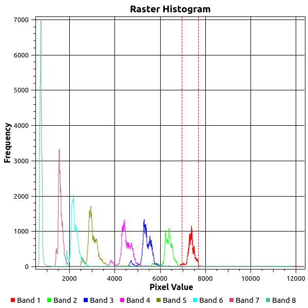
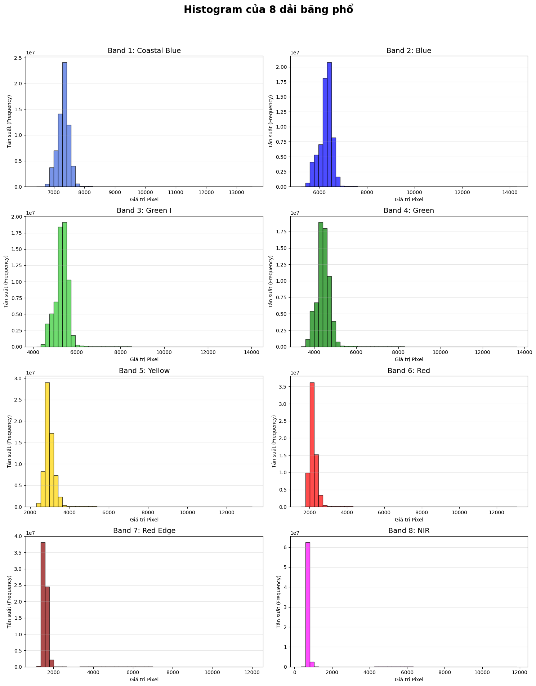
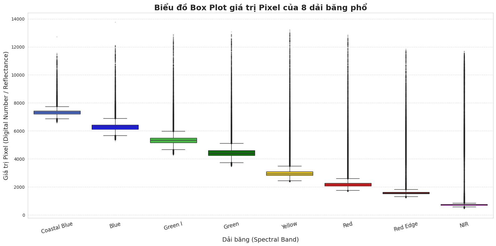

# Vega Star Task 1

## Mục tiêu
Thực hiện chuẩn hóa ảnh vệ tinh đa phổ từ định dạng 16-bit sang 8-bit để phục vụ trực quan hóa ảnh RGB, đồng thời giữ lại thông tin không gian (georeference).

## 1. Metadata ảnh gốc
Ảnh đầu vào là ảnh vệ tinh đa phổ với các đặc điểm chính:

| Thuộc tính | Giá trị |
| --- | --- |
| Kích thước | 11543 x 8070 pixels |
| Số kênh | 8 bands |
| Kiểu dữ liệu | UInt16 (16-bit) |
| Miền giá trị pixel | 0 -> 65535 |
| Định dạng | GeoTIFF (có CRS, transform) |

Các band phổ gồm:
1. Coastal Blue
2. Blue
3. Green I
4. Green
5. Yellow
6. Red
7. Red Edge
8. Near Infrared (NIR)

## 2. Bài toán chuyển đổi 16-bit -> 8-bit
Ảnh 16-bit có miền giá trị $[0, 65535]$, trong khi ảnh 8-bit có miền $[0, 255]$.

Do đó cần ánh xạ:

```text
[0, 65535] -> [0, 255]
```

Các khó khăn chính khi normalize:
1. Phân bố pixel không đồng đều.
2. Có outlier (giá trị cực lớn/cực nhỏ).
3. Dynamic range giữa các band khác nhau.

Khoảng giá trị quan sát theo band:

```text
Band 1 (Coastal Blue): Min 6970 | Max 7683
Band 2 (Blue):         Min 5728 | Max 6755
Band 3 (Green I):      Min 4716 | Max 5948
Band 4 (Green):        Min 619  | Max 12281
Band 5 (Yellow):       Min 619  | Max 12281
Band 6 (Red):          Min 619  | Max 12281
Band 7 (Red Edge):     Min 619  | Max 12281
Band 8 (NIR):          Min 619  | Max 12281
```

## 3. Phân tích histogram và đặc điểm dữ liệu




Nhận xét từ histogram:
1. Pixel không phân bố đều trên toàn miền 0 -> 12000+.
2. Mỗi band có vùng giá trị tập trung riêng.
3. Có đuôi dài (long tail), thể hiện sự tồn tại outlier.
4. Phần lớn pixel tập trung ở vùng giá trị thấp.

### Boxplot


Nhận xét từ boxplot:
1. Nhiều điểm nằm ngoài khoảng Q1-Q3 ở hầu hết các band.
2. Dữ liệu chứa nhiều outlier, rất nhạy với Min-Max scaling cơ bản.

Kết luận dữ liệu:
1. Dynamic range thực tế nhỏ hơn lý thuyết.
2. Outlier có thể làm sai lệch phép kéo giãn tương phản.
3. Các band không đồng nhất, dễ gây lệch màu khi hiển thị RGB.

## 4. Phương pháp biến đổi ảnh

### 4.1. Hạn chế của Min-Max scaling cơ bản

```text
x' = (x - min) / (max - min)
```

Nhược điểm:
1. Rất nhạy với outlier.
2. Một vài điểm nhiễu có thể làm phần lớn ảnh bị tối.
3. Mất chi tiết vùng chính do dynamic range bị kéo giãn không phù hợp.

### 4.2. Standard Deviation Stretching
Thay vì dùng min/max toàn cục, dùng thống kê trung bình và độ lệch chuẩn:

```text
mean = trung bình dữ liệu
std = độ lệch chuẩn
low = mean - k * std
high = mean + k * std
```

Sau đó clip giá trị về [low, high] trước khi scale về [0, 255].

### 4.3. Percentile Stretching
Sử dụng ngưỡng phần trăm để loại ảnh hưởng outlier:

```text
p_low = percentile(0.5%)
p_high = percentile(99.5%)
```

Tham số sử dụng:
1. `STRETCH_METHOD = "percentile"`
2. `PERCENTILES = (0.5, 99.5)`

Range theo từng band khi áp dụng percentile:

```text
Band 1: [6843.0 - 7975.0]
Band 2: [5577.0 - 7195.0]
Band 3: [4561.0 - 6793.0]
Band 4: [3729.0 - 6383.0]
Band 5: [2503.0 - 5897.0]
Band 6: [1842.0 - 5447.9]
Band 7: [1372.0 - 6053.0]
Band 8: [627.0 - 7095.0]
```

## 5. Vấn đề kích thước ảnh
Kích thước ảnh:

```text
(11543, 8070, 8)
```

Nếu mở toàn bộ ảnh trực tiếp có thể gây crash notebook do thiếu RAM.

Giải pháp: đọc ảnh theo từng window/block nhỏ để xử lý tuần tự.

## 6. Giữ thông tin tọa độ (Georeference)
Khi ghi ảnh đầu ra, cần giữ nguyên profile đọc từ rasterio (CRS, transform và metadata liên quan) để đảm bảo ảnh sau xử lý vẫn đúng hệ tọa độ.

## 7. Kết quả ảnh sau biến đổi
1. Ảnh RGB (percentile):
[Ảnh RGB](https://drive.google.com/file/d/1xg4L2zrc3KQWLQgJmvqZpEM_cnXaqhN-/view?usp=sharing)
2. Ảnh TIFF đầu ra:
[Ảnh TIFF](https://drive.google.com/file/d/1BtU9qb74vcsULC4Y-nMLYs-TzJ1llP5I/view?usp=sharing)

## 8. Đánh giá chất lượng sau biến đổi theo từng band

| Band | PSNR (dB) | SSIM | Entropy |
| --- | ---: | ---: | ---: |
| 1 | 21.26 | 0.8517 | 5.88 |
| 2 | 24.06 | 0.7655 | 5.58 |
| 3 | 17.70 | 0.6717 | 5.52 |
| 4 | 13.34 | 0.6154 | 5.56 |
| 5 | 9.35 | 0.3458 | 4.84 |
| 6 | 8.80 | 0.1831 | 4.57 |
| 7 | 7.11 | 0.0802 | 3.70 |
| 8 | 6.81 | 0.0212 | 2.62 |

Kết luận: với mục tiêu trực quan hóa ảnh RGB, phương pháp percentile cho khả năng giữ thông tin thị giác tốt hơn trong bối cảnh dữ liệu có nhiều outlier